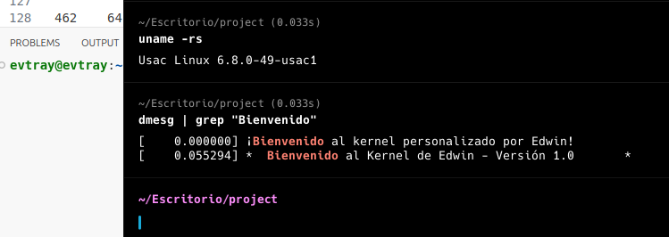
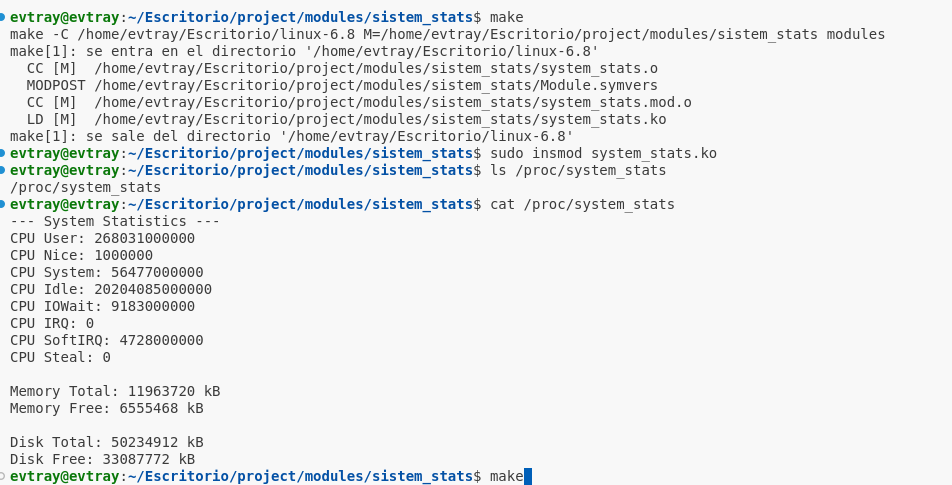
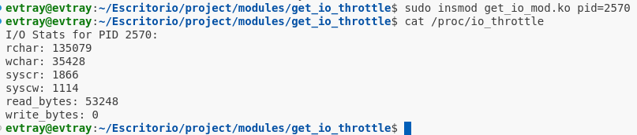

## Laboratorio Sistemas Operativos 2 ##

### PRACTICA 1 ###

### **Nombre:** Edwin Sandoval Lopez
### **Carne:** 202010856  

**Implementación del Syscall `capture_memory_snapshot`:**


**Introducción y Objetivos del Proyecto:**  
   - **Objetivos generales:** Este proyecto desafía a los estudiantes a personalizar y expandir el kernel de Linux, permitiéndoles
      modificar su comportamiento y agregar nuevas funcionalidades. Involucra la configuración de un
      entorno de desarrollo adecuado para la compilación del kernel, la implementación de cambios
      personalizados en el sistema y el desarrollo de módulos que añaden llamadas al sistema.

   - **Objetivos específicos:** 
     - Configurar un entorno de desarrollo para el kernel.  
     - Personalizar el nombre del sistema y agregar mensajes de inicio.  
          - Implementar tres nuevas syscalls personalizadas (`capture_memory_snapshot`, `track_syscall_usage`, `get_io_throttle`).  
     - Desarrollar módulos para obtener estadísticas del sistema (CPU, memoria, almacenamiento).

**Configuración del Entorno:**  
    1) Descargar el kernel de kernel.org (linux-6.8.tar.xz)
    2)Descomprimirlo
    3) Instalar las dependencias
    sudo apt-get install build-essential libncurses5-dev fakeroot wget bzip2 openssl
    sudo apt-get install build-essential libncurses-dev bison flex libssl-dev libelf-dev

    A partir de aca, en el directorio del codigo fuente. Estando como usuario root con "sudo -s"

    4) Copiar el archivo de config por primera vez
    cp -v /boot/config-$(uname -r) .config

    5) Limpiar el ambiente de compilacion
    make clean

    5.5) Modificar la version del kernel en el archivo Makefile que esta en la raiz

    Hasta arriba, estara asi:

    EXTRAVERSION = 
    EXTRAVERSION = -49-usac1


    6) Ejecutar los config iniciales:
    make oldconfig

    Darle enter a todo
    7) make localmodconfig

    8)Deshabilitar los certificados de firma oficiales de Cannonical:

    scripts/config --disable SYSTEM_TRUSTED_KEYS
    scripts/config --disable SYSTEM_REVOCATION_KEYS


    9)Ahora te podes guiar del script "compile_and_install.sh" para compilar e instalar
    Lo copias con nana, bloc de notas o como prefiras
    Lo marcas con "chmod +x compile_and_install.sh" para permitir que se ejecute
    ./compile_and_install.sh

    Le das que no a todo lo de config (le podes dar enter por defecto)

    10)vas por un cafe en lo que se compila


    11) Le das que si a todos los comandos que te pregunte de install
    Los hace automatico, pero si lo queres hacer manualmente:
    make modules_install
    make install
    make headers_install

**Descripción de Modificaciones en el Kernel:**  
   - **Personalización del nombre:** 
      En `/include/linux/uts.h` editar la funciòn  start_kernel(), 
      ```c
        #define UTS_SYSNAME "Usac Linux - 202010856"
      ```
   - **Personalización del mensajes de inicio:** 
      En `/init/main.c` editar la funciòn  start_kernel(), 
      ```c
          void start_kernel(void)
          {
          //codigo
          	printk("******************************************************\n");
            printk("*                                                    *\n");
            printk("*  Bienvenido al Kernel de Edwin - Versión 1.0       *\n");
            printk("*  Donde la personalización se encuentra con la      *\n");
            printk("*  potencia del sistema Linux. ¡A programar! 🚀      *\n");
            printk("*                                                    *\n");
            printk("******************************************************\n");
          //codigo 
          }
      ```
## Compilar el kernel

``` bash
💡 sudo make -j$(nproc)
```
```bash
$ sudo make modules_install
```

```bash
$ sudo make install
```

```bash
$ sudo reboot
```
## Verificacion de los cambios del Kernel

```bash
$ uname -rs
```

```bash
 $ dmesg | grep "Bienvenido"
 ```

---
# Llamadas al sistema

Para agregar la syscall `capture_memory_snapshot`, primero se seleccionó un número de syscall no utilizado (ej. 462) y se actualizó el archivo `arch/x86/entry/syscalls/syscall_64.tbl` agregando una línea como:

```
462    64    capture_memory_snapshot    sys_capture_memory_snapshot
```

Posteriormente, se implementó la función `SYSCALL_DEFINE` correspondiente en el código del kernel (por ejemplo en `kernel/capture_snapshot.c`).


Para instalar la nueva syscall en el kernel:

1. **Actualización de la Tabla de Syscalls:**  
   Se editó `syscall_64.tbl` para asignar el número de syscall a `capture_memory_snapshot`.

2. **Definición de la Syscall en el Código del Kernel:**  
   Se creó la función `SYSCALL_DEFINE` que implementa la lógica de `capture_memory_snapshot`.  
   Retorna 0 en caso de éxito, o un valor negativo si hay error (por ejemplo, si user_snap apunta a memoria no válida).

3. **Compilación e Integración con el Kernel:**  
   El archivo `capture_snapshot.c` se incluyó en el `Makefile` del kernel (ej. `obj-y += capture_snapshot.o`) y se recompiló el kernel. Tras reiniciar con el nuevo kernel, la syscall quedó disponible para su uso en espacio de usuario.


**Implementación del Syscall `track_syscall_usage`:**

Para agregar la syscall `track_syscall_usage`, primero se seleccionó un número de syscall no utilizado (ej. 463) y se actualizó el archivo `arch/x86/entry/syscalls/syscall_64.tbl` agregando una línea como:

```
463    64    track_syscall_usage    sys_track_syscall_usage
```

Posteriormente, se implementó la función `SYSCALL_DEFINE` correspondiente en el código del kernel (por ejemplo en `kernel/track_usage.c`). Esta función recibe un buffer y un tamaño, y copia al espacio de usuario la información recopilada sobre el uso de las syscalls interceptadas.

Para instalar la nueva syscall en el kernel:

1. **Actualización de la Tabla de Syscalls:**  
   Se editó `syscall_64.tbl` para asignar el número de syscall a `track_syscall_usage`.

2. **Definición de la Syscall en el Código del Kernel:**  
   Se creó la función `SYSCALL_DEFINE` que implementa la lógica de `track_syscall_usage`.  
   Esta función se encarga de devolver un arreglo de estructuras con información sobre las syscalls monitoreadas (por ejemplo, `open`, `read`, `write`, `fork`): contador de invocaciones y último timestamp.

3. **Compilación e Integración con el Kernel:**  
   El archivo `track_usage.c` se incluyó en el `Makefile` del kernel (ej. `obj-y += track_usage.o`) y se recompiló el kernel. Tras reiniciar con el nuevo kernel, la syscall quedó disponible para su uso en espacio de usuario.

Una vez instalada la syscall, un programa en espacio de usuario puede invocarla mediante `syscall(464, info, size)`, obteniendo así los datos recolectados. Este proceso de agregar la syscall se empleará igualmente para los otros dos syscalls personalizados del proyecto, siguiendo el mismo procedimiento: elegir un número libre, actualizar `syscall_64.tbl`, implementar la función `SYSCALL_DEFINE` con su lógica específica, recompilar el kernel e iniciar con él.


---

**Secciones del Código:**
  ```c
  #include <linux/kernel.h>
  #include <linux/syscalls.h>
  #include <linux/timekeeping.h>
  #include <linux/module.h>
  #include <linux/init.h>
  #include <linux/spinlock.h>
  #include <linux/uaccess.h>
  #include <linux/string.h>
  ```

  Estas incluyen las funciones y tipos necesarios para:
  - Definir syscalls.
  - Trabajar con tiempo (nanosegundos).
  - Gestionar sincronización por spinlocks.
  - Acceder a funciones específicas del kernel y estructuras básicas.
  
- **Declaración de la Tabla de Syscalls:**
  ```c
  extern void* sys_call_table[];
  ```

  Este puntero externo hace referencia a la tabla de llamadas al sistema que se modificará para interceptar las syscalls.  
  *(En la implementación real, la obtención de `sys_call_table` puede requerir técnicas adicionales.)*

- **Definición de Estructuras:**
  ```c
  struct my_tracked_syscall_info {
      const char *name;               // Nombre simbólico de la syscall
      unsigned long count;            // Conteo de invocaciones
      u64 last_timestamp_ns;          // Último timestamp en nanosegundos
      asmlinkage long (*original)(const struct pt_regs *); // Puntero a la función original
  };
  ```

  Esta estructura almacena información acerca de cada syscall monitoreada.

- **Arreglo de Syscalls Monitoreadas:**
  ```c
  static struct my_tracked_syscall_info monitored_syscalls[] = {
      { .name = "open",  .count = 0, .last_timestamp_ns = 0, .original = NULL },
      { .name = "read",  .count = 0, .last_timestamp_ns = 0, .original = NULL },
      { .name = "write", .count = 0, .last_timestamp_ns = 0, .original = NULL },
      { .name = "fork",  .count = 0, .last_timestamp_ns = 0, .original = NULL }
  };
  static int monitored_count = 4;
  ```
  
  Aquí se listan las syscalls a interceptar. `monitored_count` indica cuántas se están rastreando.

- **Spinlock para Sincronización:**
  ```c
  static DEFINE_SPINLOCK(syscall_usage_lock);
  ```

  Este lock protege el acceso a las estructuras contadoras, evitando condiciones de carrera cuando múltiples CPUs actualizan las estadísticas simultáneamente.

- **Wrappers de Syscalls Interceptadas:**
  Cada syscall interceptada tiene un wrapper que:
  1. Obtiene el timestamp actual.
  2. Incrementa el contador y actualiza el timestamp en la estructura correspondiente.
  3. Llama a la función original para no alterar el comportamiento del sistema.
  
  Ejemplo para `read`:
  ```c
  static asmlinkage long hooked_read(const struct pt_regs *regs) {
      long ret;
      u64 now = ktime_get_ns();
      unsigned long flags;

      spin_lock_irqsave(&syscall_usage_lock, flags);
      monitored_syscalls[1].count++;
      monitored_syscalls[1].last_timestamp_ns = now;
      spin_unlock_irqrestore(&syscall_usage_lock, flags);

      ret = monitored_syscalls[1].original(regs);
      return ret;
  }
  ```
  
  Se implementan wrappers similares para `open`, `write` y `fork`.

- **Modificación de la sys_call_table:**
  Antes de escribir en la `sys_call_table`, se deshabilita la protección de sólo lectura, se guardan los punteros originales, se escriben las nuevas direcciones de las funciones wrapper, y luego se restaura la protección de la tabla.

  ```c
  // Ejemplo: sys_call_table[__NR_read] = (void*)hooked_read;
  ```

- **Nueva Syscall: `track_syscall_usage`:**
  Esta syscall se define utilizando `SYSCALL_DEFINE`:
  ```c
  struct syscall_usage_user {
      char name[16];
      unsigned long count;
      unsigned long long last_timestamp_ns;
  };

  SYSCALL_DEFINE2(track_syscall_usage, struct syscall_usage_user __user *, buf, int, size) {
      int i;
      unsigned long flags;

      // Verifica que el buffer en el espacio de usuario sea suficiente
      if (size < monitored_count)
          return -EINVAL;

      spin_lock_irqsave(&syscall_usage_lock, flags);
      for (i = 0; i < monitored_count; i++) {
          struct syscall_usage_user temp;
          strncpy(temp.name, monitored_syscalls[i].name, sizeof(temp.name));
          temp.count = monitored_syscalls[i].count;
          temp.last_timestamp_ns = monitored_syscalls[i].last_timestamp_ns;

          if (copy_to_user(&buf[i], &temp, sizeof(temp))) {
              spin_unlock_irqrestore(&syscall_usage_lock, flags);
              return -EFAULT;
          }
      }
      spin_unlock_irqrestore(&syscall_usage_lock, flags);

      return monitored_count;
  }
  ```

---
**Implementación del Syscall `get_io_throttle`:**

Para agregar la syscall `capture_memory_snapshot`, primero se seleccionó un número de syscall no utilizado (ej. 464) y se actualizó el archivo `arch/x86/entry/syscalls/syscall_64.tbl` agregando una línea como:

```
464    64    capture_memory_snapshot    sys_capture_memory_snapshot
```

Posteriormente, se implementó la función `SYSCALL_DEFINE` correspondiente en el código del kernel (por ejemplo en `kernel/get_io_throttle.c`).


Para instalar la nueva syscall en el kernel:

1. **Actualización de la Tabla de Syscalls:**  
   Se editó `syscall_64.tbl` para asignar el número de syscall a `get_io_throttle`.

2. **Definición de la Syscall en el Código del Kernel:**  
   Se creó la función `SYSCALL_DEFINE` que implementa la lógica de `get_io_throttle`.  
   Retorna 0 en caso de éxito, o un valor negativo si hay error (por ejemplo, si user_snap apunta a memoria no válida).

3. **Compilación e Integración con el Kernel:**  
   El archivo `get_io_throttle.c` se incluyó en el `Makefile` del kernel (ej. `obj-y += get_io_throttle.o`) y se recompiló el kernel. Tras reiniciar con el nuevo kernel, la syscall quedó disponible para su uso en espacio de usuario.

```c
#include <linux/kernel.h>
#include <linux/syscalls.h>
#include <linux/uaccess.h>
#include <linux/pid.h>
#include <linux/sched.h>
#include <linux/sched/signal.h>
#include <linux/types.h>

struct io_stats_user {
    unsigned long long rchar;
    unsigned long long wchar;
    unsigned long long syscr;
    unsigned long long syscw;
    unsigned long long read_bytes;
    unsigned long long write_bytes;
};

SYSCALL_DEFINE2(get_io_throttle, int, pid, struct io_stats_user __user *, udata)
{
    struct task_struct *task;
    struct io_stats_user stats;

    rcu_read_lock();
    task = pid_task(find_vpid(pid), PIDTYPE_PID);
    if (!task) {
        rcu_read_unlock();
        return -ESRCH; 
    }

    // Acceso a las estadísticas en task->ioac
    // Estos campos se encuentran en task->ioac.rchar, etc.
    stats.rchar = task->ioac.rchar;
    stats.wchar = task->ioac.wchar;
    stats.syscr = task->ioac.syscr;
    stats.syscw = task->ioac.syscw;
    stats.read_bytes = task->ioac.read_bytes;
    stats.write_bytes = task->ioac.write_bytes;

    rcu_read_unlock();

    if (copy_to_user(udata, &stats, sizeof(stats)))
        return -EFAULT;

    return 0;
}
```
**4. Detalles de las Nuevas Llamadas al Sistema:**  
   - **Estructura general:** Describa el proceso general para agregar una syscall: asignar un número en `syscall_64.tbl`, definir la función con `SYSCALL_DEFINE`, e integrar el código al kernel.  
   - **Syscall `capture_memory_snapshot`:**  
     - **Propósito:** Capturar el estado de la memoria (páginas libres, cache, buffers, etc.)  
     - **Implementación:** Indique los archivos, funciones internas (`si_meminfo()`, `global_node_page_state()`) y estructuras (`struct mem_snapshot`) utilizadas.  
     - **Ejemplo de uso:** Muestre cómo un programa en espacio de usuario llama a esta syscall y qué resultados obtiene.  
   - **Syscall `track_syscall_usage`:**  
     - **Propósito:** Monitorear y contar cuántas veces se ejecutan ciertas syscalls (ej. `read`, `write`).  
     - **Implementación:** Describa cómo se realizó el hooking de `sys_call_table`, las estructuras para almacenar conteos y timestamps, y la syscall que devuelve estos datos.  
     - **Ejemplo de uso:** Presente el código en espacio de usuario que llama la syscall y muestra los contadores.  
   - **Syscall `get_io_throttle`:**  
     - **Propósito:** Obtener estadísticas de I/O de un proceso específico (bytes leídos/escritos, etc.).  
     - **Implementación:** Explique cómo se accedió a `task_struct` y `task->ioac` para obtener estadísticas, y cómo se devolvieron al usuario en una estructura.  
     - **Ejemplo de uso:** Ejecute el programa de prueba con el PID de un proceso y muestre el resultado.

**5. Pruebas Realizadas:**  
   - **Pruebas de arranque del kernel:** Mencione cómo se verificó que el kernel arranca correctamente, con el nombre personalizado y los mensajes de inicio presentes en `dmesg`.  
   - **Pruebas de las syscalls:**  
     - Para `capture_memory_snapshot`: Ejecute el programa de prueba y verifique que las estadísticas de memoria correspondan a las reportadas por herramientas del sistema (`free`, `/proc/meminfo`).
     - Para `track_syscall_usage`: Ejecute el programa de prueba antes y después de realizar operaciones de I/O (por ejemplo, usando `cat`, `ls`, etc.) y observe cómo los conteos se incrementan.  
     - Para `get_io_throttle`: Seleccione un proceso (por ejemplo, el PID de `bash` o de un programa que lee y escribe archivos), invoque la syscall y verifique que las estadísticas correspondan a la carga esperada.  
   - **Módulos del kernel:**  
     - Describa las pruebas realizadas con los módulos que muestran estadísticas de CPU, memoria y almacenamiento, y cómo se verificó su correcto funcionamiento (por ejemplo, leyendo las entradas en `/proc` o usando un script de prueba).

**6. Reflexión Personal:**  
A continuación se presenta una documentación descriptiva sobre la creación, implementación y funcionamiento del módulo `system_stats` que expone estadísticas del sistema a través de una entrada en `/proc`.

---

### MODULE SYSTEM STATS

1. **Elección del lenguaje y entorno:**  
   Se usó el lenguaje C, ya que es el estándar para el desarrollo de módulos del kernel Linux. El módulo se implementó sobre un kernel Linux ya configurado y con las cabeceras (`linux-headers`) o el árbol de código fuente del kernel preparado mediante `make modules_prepare`.

2. **Código Fuente (`system_stats.c`):**  
   El archivo fuente del módulo define las funciones necesarias para:
   - Crear una entrada en `/proc` al cargar el módulo.
   - Obtener estadísticas de CPU, memoria y disco utilizando las APIs internas del kernel (ej. `si_meminfo()` para memoria, `vfs_statfs()` para el disco, y `kcpustat_cpu()` para CPU).
   - Implementar la función `show` que, al leer el archivo en `/proc`, imprime la información recolectada.

   Se utilizan las siguientes estructuras y funciones:
   - **Para Memoria:** `si_meminfo()` y `global_node_page_state()` para obtener información total y libre.
   - **Para Almacenamiento:** `kern_path()` y `vfs_statfs()` para obtener espacio total y libre de una partición especificada.
   - **Para CPU:** `kcpustat_cpu()` para acceder a los contadores de tiempo de CPU en diversos estados (user, system, idle, etc.).

   En versiones modernas del kernel, en vez de `struct file_operations`, se usa `struct proc_ops` para las operaciones del archivo `/proc`. Así, el código adapta su implementación a esta interfaz.

3. **Makefile y Compilación:**
   Se creó un `Makefile` simple con aproximadamente este contenido:
   ```make
   obj-m += system_stats.o

   all:
   	make -C /path/to/kernel/source M=$(PWD) modules (ejm: make -C /home/evtray/Escritorio/linux-6.8 M=$(PWD) modules)

   clean:
   	make -C /path/to/kernel/source M=$(PWD) clean (ejm: make -C /home/evtray/Escritorio/linux-6.8 M=$(PWD) clean)
   ```
   
   Aquí, `/path/to/kernel/source` es la ruta al árbol de código fuente del kernel preparado con `make modules_prepare`.  
   Ejecutando `make`, se genera el archivo `system_stats.ko`, listo para ser insertado en el kernel.

4. **Carga del Módulo:**
   Una vez compilado, para cargar el módulo se usa:
   ```bash
   sudo insmod system_stats.ko
   ```
   
   Si no hay errores, se creará `/proc/system_stats`.

5. **Verificación:**
   Se puede verificar su correcto funcionamiento ejecutando:
   ```bash
   cat /proc/system_stats
   ```
   
   Esto mostrará datos como:
   - Estadísticas de CPU (tiempos acumulados en distintos estados).
   - Memoria total y libre.
   - Espacio total y libre del almacenamiento en la partición especificada.

   
   
6. **Descarga del Módulo:**
   Cuando ya no se necesite el módulo, se descarga con:
   ```bash
   sudo rmmod system_stats
   ```
   
   Esto removerá la entrada `/proc/system_stats`.

---

### Cómo Funciona el Módulo Internamente

1. **Creación de la Entrada en `/proc`:**  
   Al cargar el módulo, la función `system_stats_init()` llama a `proc_create()` para generar una entrada llamada `system_stats` en `/proc`. Esta función recibe un `struct proc_ops` con las funciones para gestionar la apertura, lectura, desplazamiento y cierre del archivo virtual. En este caso, se utiliza `single_open()` y `seq_read()` para facilitar la presentación de datos.

2. **Obtención de Estadísticas:**
   - **Memoria:**  
     Se usa `si_meminfo()` para obtener la información global de la memoria (total, libre). Estos valores se imprimen convertidos a kilobytes.
   
   - **Almacenamiento:**  
     A través de `kern_path()` y `vfs_statfs()` se obtiene la información de una partición particular (ej. `/`), mostrando el total de espacio y el espacio libre.
   
   - **CPU:**  
     Se recorren todos los CPUs lógicos con `for_each_possible_cpu()` y se suman los contadores obtenidos con `kcpustat_cpu()`. Esto brinda tiempos acumulados en modo usuario, sistema, idle, etc. El módulo muestra estos valores tal cual son, sin convertirlos en porcentajes, pero estos datos pueden servir para cálculos posteriores.

3. **Interfaz con Espacio de Usuario:**
   Al ejecutar `cat /proc/system_stats`, el kernel invoca la función `show` del `seq_file`, la cual llama internamente a las funciones que obtienen las estadísticas. Dichas estadísticas se formatean en texto y se imprimen en la secuencia (`seq_printf`). El usuario, al leer el archivo, ve estos datos directamente.

---

### Modulos para las syscalls creadas anteriormente

A continuación se presenta la documentación que describe el proceso de creación, instalación y uso de los módulos del kernel desarrollados para exponer estadísticas del sistema y resultados de las syscalls personalizadas.

---

### Introducción

Estos módulos del kernel se crearon con el objetivo de exponer, mediante archivos en `/proc`, información que antes se obtenía a través de las syscalls personalizadas. De esta manera, los usuarios pueden inspeccionar las estadísticas del sistema con simples lecturas (`cat`) a archivos en el sistema de ficheros `procfs`. Cada módulo corresponde a una funcionalidad distinta:

- `capture_mem_mod`: Muestra un snapshot de la memoria.
- `track_syscalls_mod`: Presenta el conteo y últimos timestamps de ciertas syscalls monitorizadas.
- `io_throttle_mod`: Muestra estadísticas de I/O para un proceso específico.
- `system_stats`: Ofrece estadísticas generales de CPU, memoria y almacenamiento.

---

### Creación de los Módulos

1. **Código Fuente y Estructura de Archivos:**  
   Cada módulo se implementó en un archivo `.c` separado (por ejemplo, `capture_mem_mod.c`, `track_syscalls_mod.c`, etc.). Estos archivos incluyen:
   - Cabeceras del kernel (`<linux/module.h>`, `<linux/proc_fs.h>`, `<linux/seq_file.h>`, etc.).
   - Funciones `init` y `exit` marcadas con `module_init()` y `module_exit()`.
   - Una función principal de lectura (`show`) que usa la API de `seq_file` para imprimir las estadísticas.
   - Estructuras `proc_ops` para definir cómo se lee el archivo `/proc`.

   Por ejemplo, `capture_mem_mod.c` crea `/proc/capture_mem` y al leerlo, muestra el estado actual de la memoria. Esto replica la lógica de la syscall `capture_memory_snapshot`, pero ahora como un módulo independiente.

2. **Makefile para Compilación:**  
   En el directorio donde se encuentra el código fuente de cada módulo, se crea un `Makefile` simple con contenido similar a:
   ```make
   obj-m += system_stats.o

   all:
   	make -C /path/to/kernel/source M=$(PWD) modules (ejm: make -C /home/evtray/Escritorio/linux-6.8 M=$(PWD) modules)

   clean:
   	make -C /path/to/kernel/source M=$(PWD) clean (ejm: make -C /home/evtray/Escritorio/linux-6.8 M=$(PWD) clean)
   ```
   
   Ajustando el `-C /ruta/al/kernel` si se cuenta con el árbol de código fuente del kernel en otra ubicación. Esto utilizará el sistema de build del kernel para compilar el módulo.

3. **Configuración del Entorno:**  
   Antes de compilar, es necesario tener instaladas las cabeceras del kernel (`linux-headers-<versión>`). Por ejemplo:
   ```bash
   sudo apt-get install linux-headers-$(uname -r)
   ```

   Si se está utilizando un kernel personalizado, se debe contar con el árbol de código fuente del kernel y haber ejecutado `make modules_prepare` para preparar el entorno antes de compilar módulos externos.

---

### Instalación de los Módulos

1. **Compilación:**
   Desde el directorio que contiene el código fuente y el Makefile del módulo, ejecutar:
   ```bash
   make
   ```
   
   Si todo va bien, se generará un archivo `.ko`, por ejemplo `capture_mem_mod.ko`.

2. **Carga del Módulo:**
   Para insertar el módulo en el kernel:
   ```bash
   sudo insmod capture_mem_mod.ko
   ```
   
   Si el módulo necesita parámetros (como en el caso de `io_throttle_mod` que requiere un `pid`), se puede especificar:
   ```bash
   sudo insmod io_throttle_mod.ko pid=1234
   ```

3. **Creación de la Entrada en /proc:**
   Una vez cargado, el módulo creará un archivo en `/proc` (por ejemplo, `/proc/capture_mem` o `/proc/track_syscalls`). No es necesario ningún otro paso, la creación ocurre automáticamente.

4. **Verificación de la Funcionalidad:**
   Para leer la información expuesta por el módulo:
   ```bash
   cat /proc/capture_mem
   ```
   Mostrará las estadísticas correspondientes. Lo mismo para los demás módulos:
   ```bash
   cat /proc/track_syscalls
   cat /proc/io_throttle
   cat /proc/system_stats
   ```
   
   
5. **Descarga del Módulo:**
   Si ya no se necesita el módulo en memoria, se descarga con:
   ```bash
   sudo rmmod capture_mem_mod
   ```
   
   Esto removerá la entrada `/proc` asociada.

---

### Consideraciones Adicionales

- **Dependencias entre Módulos:**
  Si el módulo `track_syscalls_mod` necesita acceso a variables globales definidas en el código del hooking (donde se interceptaron las syscalls), es necesario exportar esos símbolos con `EXPORT_SYMBOL()` en el módulo (o kernel) que los define. Luego, primero se carga el módulo que exporta las variables y después el que las utiliza.

- **Permisos y Seguridad:**
  Estos módulos exponen información en `/proc` sin ninguna autenticación. Por defecto, `/proc` es legible por todos, por lo que la información quedará accesible a cualquier usuario. Si se requieren restricciones, se pueden ajustar los permisos al crear el archivo `/proc`.

- **Mantenimiento y Limpieza:**
  Después de probar y validar el funcionamiento, siempre es buena práctica remover los módulos y limpiar el directorio:
  ```bash
  make clean
  ```
  
  Esto eliminará los archivos generados durante la compilación.

---

### Conclusión

La creación e instalación de estos módulos facilita la visualización de estadísticas del sistema y la verificación de las syscalls personalizadas desarrolladas en el proyecto. Con simples lecturas a `/proc`, es posible acceder a datos internos del kernel de manera flexible y transparente. El flujo general es:

1. Escribir el código fuente del módulo (`.c`), usando `proc_create()` y `seq_file`.
2. Preparar el entorno con cabeceras del kernel.
3. Compilar con `make`.
4. Insertar el módulo (`insmod`) y leer los datos en `/proc`.
5. Cuando ya no se necesite, remover el módulo (`rmmod`) y limpiar (`make clean`).

Esta documentación provee los fundamentos necesarios para comprender y replicar el proceso en entornos similares.