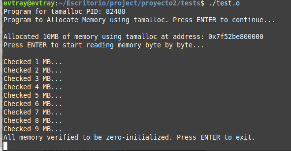
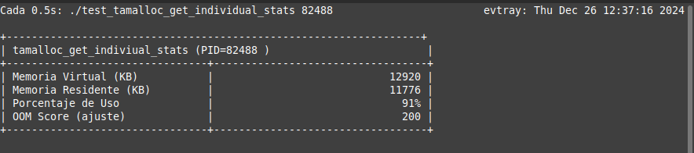
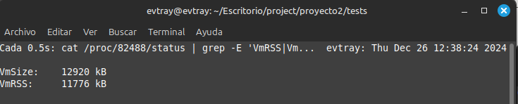
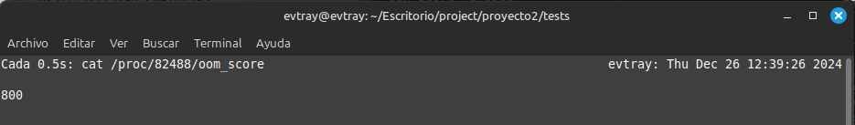
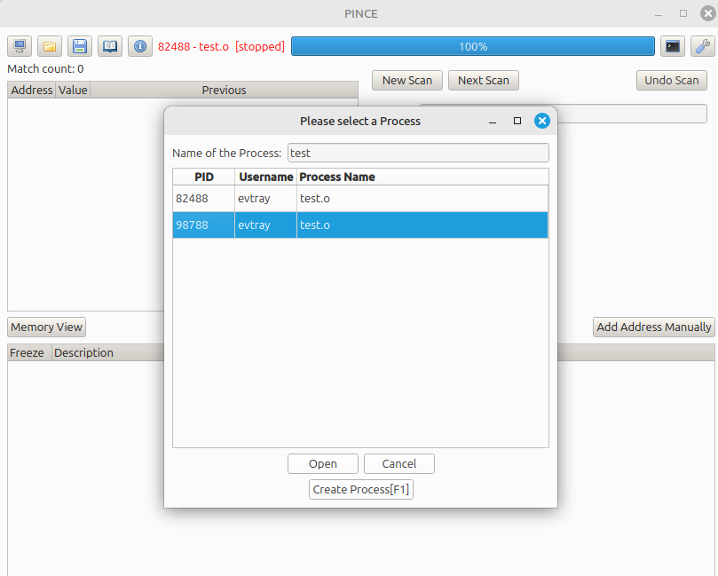
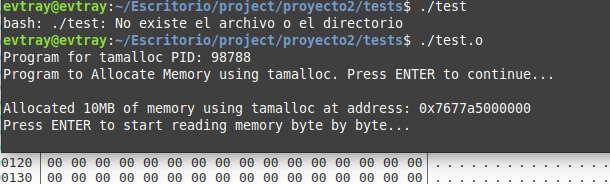
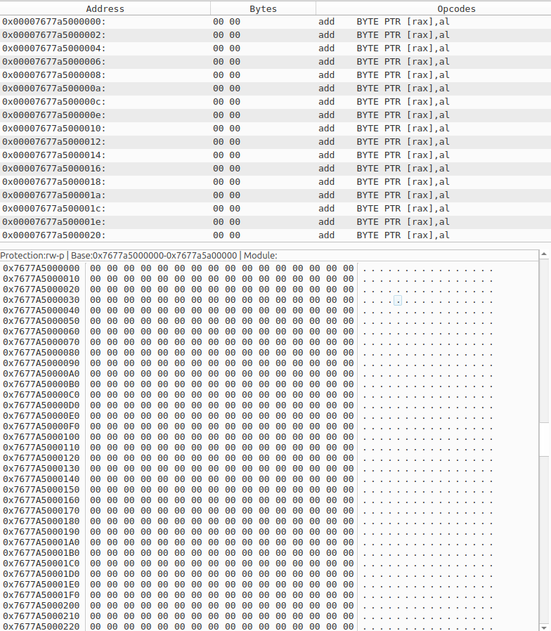
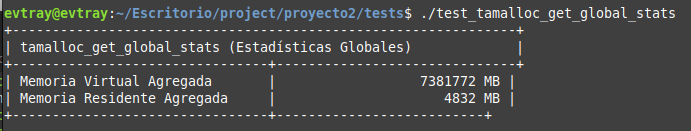

## Laboratorio Sistemas Operativos 2 ##

### PRACTICA 2 ###

### **Nombre:** Edwin Sandoval Lopez
### **Carne:** 202010856  

Syscalls desarrolladas:

- **Syscall 551**: `tamalloc_get_stats` (asigna memoria con lazy-zeroing)  
- **Syscall 552**: `tamalloc_get_global_stats` (recolecta estadísticas de memoria globales)  
- **Syscall 553**: `tamalloc_get_indiviual_stats` (recolecta estadísticas de memoria de un proceso específico)


1. **Referencia en la tabla de syscalls**  
2. **Implementación del código kernel**  
3. **Estructuras y prototipos**  
4. **Ejemplos de uso en espacio de usuario (programas de prueba)**  
5. **Notas sobre compilación e instalación**  

---

# 1. Tabla de Syscalls (x86_64)

En el archivo `arch/x86/entry/syscalls/syscall_64.tbl`, se deben añadir (o asegurarse de que existan) las siguientes líneas con los números **551**, **552** y **553**:

```plaintext
551    64   tamalloc_get_stats        sys_tamalloc_get_stats
552    64   tamalloc_get_global_stats sys_tamalloc_get_global_stats
553    64   tamalloc_get_indiviual    sys_tamalloc_get_indiviual_stats
```

---

# 2. Implementación en el Kernel

- **Incluir los encabezados** adecuados (`#include <linux/syscalls.h>`, `#include <linux/mm.h>`, etc.).  
- **Definir** cada syscall con la macro `SYSCALL_DEFINEX`, donde X es la cantidad de parámetros.

## 2.1. Syscall 551: `tamalloc_get_stats`

**Objetivo**: Asignar memoria en modo “lazy-zeroing” (sin comprometer inmediatamente todas las páginas). Retorna la **dirección virtual** donde se mapeó la memoria.

```c
#include <linux/kernel.h>
#include <linux/syscalls.h>
#include <linux/mm.h>
#include <linux/mman.h>
#include <linux/errno.h>
#include <linux/sched.h>

/*
 * Syscall 551:
 * long tamalloc_get_stats(size_t size);
 *
 * Asigna 'size' bytes de memoria anónima sin reservar físicamente todas las
 * páginas desde el inicio (MAP_NORESERVE). El kernel rellenará en cero al
 * producirse el primer acceso (page fault).
 *
 * Retorna: 
 *   >= 0  : Dirección virtual de inicio del mapeo en espacio de usuario.
 *   < 0   : Código de error (negativo).
 */
SYSCALL_DEFINE1(tamalloc_get_stats, size_t, size)
{
    unsigned long aligned_size, addr;

    // 1. Validar parámetro
    if (size == 0)
        return -EINVAL;

    // 2. Alinear el tamaño a múltiplos de PAGE_SIZE
    aligned_size = PAGE_ALIGN(size);
    if (!aligned_size)
        return -ENOMEM;

    // 3. Crear mapeo virtual con MAP_ANONYMOUS | MAP_PRIVATE | MAP_NORESERVE
    addr = vm_mmap(
        NULL,                      // struct file *file (NULL => anónimo)
        0,                         // dirección sugerida (0 => el kernel elige)
        aligned_size,              // tamaño del mapeo
        PROT_READ | PROT_WRITE,    // protección (lectura/escritura)
        MAP_PRIVATE | MAP_ANONYMOUS | MAP_NORESERVE,
        0
    );

    // 4. Verificar errores
    if (IS_ERR_VALUE(addr)) {
        printk(KERN_ERR "tamalloc_get_stats: Error al mapear memoria.\n");
        return -ENOMEM;
    }

    // 5. Retornar dirección virtual al espacio de usuario
    return addr;
}
```
---

## 2.2. Syscall 552: `tamalloc_get_global_stats`

**Objetivo**: Obtener estadísticas **globales** de memoria de **todos** los procesos:  
- Memoria reservada total (suma de `VmSize`)  
- Memoria utilizada total (suma de `VmRSS`)  

Se define una estructura `global_memory_stats` que se envía desde el usuario y se rellena en el kernel.

```c
#include <linux/kernel.h>
#include <linux/syscalls.h>
#include <linux/mm.h>
#include <linux/sched.h>
#include <linux/uaccess.h>
#include <linux/rcupdate.h>

/* Estructura para las estadísticas globales (en MB) */
struct global_memory_stats {
    size_t total_reserved_memory_mb; // Suma de VmSize (en MB)
    size_t total_used_memory_mb;     // Suma de VmRSS (en MB)
};

/*
 * Syscall 552:
 * long tamalloc_get_global_stats(struct global_memory_stats __user *stats);
 *
 * Recorre todos los procesos del sistema y acumula:
 *   - Memoria reservada total (VmSize) => total_vm * PAGE_SIZE
 *   - Memoria utilizada total (VmRSS)  => get_mm_rss(mm) * PAGE_SIZE
 * Convierte a MB y retorna en 'stats'.
 */
SYSCALL_DEFINE1(tamalloc_get_global_stats,
                struct global_memory_stats __user *, stats)
{
    struct task_struct *task;
    struct global_memory_stats kstats = {0};
    struct mm_struct *mm;

    // 1. Proteger la iteración con RCU
    rcu_read_lock();

    for_each_process(task) {
        // Evitar procesos sin mm (kernel threads) o zombies
        if (task->exit_state == EXIT_ZOMBIE)
            continue;

        mm = get_task_mm(task);
        if (!mm)
            continue;

        // Acumular total_vm (VmSize)
        kstats.total_reserved_memory_mb +=
            (mm->total_vm * PAGE_SIZE) >> 20; // / (1024 * 1024)

        // Acumular RSS
        kstats.total_used_memory_mb +=
            (get_mm_rss(mm) * PAGE_SIZE) >> 20;

        mmput(mm);
    }

    rcu_read_unlock();

    // 2. Copiar resultados al espacio de usuario
    if (copy_to_user(stats, &kstats, sizeof(kstats)))
        return -EFAULT;

    return 0;
}
```
---

## 2.3. Syscall 553: `tamalloc_get_indiviual_stats`

**Objetivo**: Para un PID dado, retornar estadísticas de memoria:  
- Memoria reservada (VmSize)  
- Memoria utilizada (VmRSS)  
- Porcentaje de uso  
- OOM Score (o ajustado)  

Definimos una estructura `process_memory_stats` que se llena con estos datos.

```c
#include <linux/kernel.h>
#include <linux/syscalls.h>
#include <linux/mm.h>
#include <linux/sched.h>
#include <linux/pid.h>
#include <linux/rcupdate.h>
#include <linux/uaccess.h>

/* Estructura para estadísticas individuales */
struct process_memory_stats {
    size_t reserved_memory_kb;         // VmSize (en KB)
    size_t used_memory_kb;             // VmRSS (en KB)
    unsigned int used_memory_percentage;
    int oom_score;
};

/*
 * Syscall 553:
 * long tamalloc_get_indiviual_stats(pid_t pid, struct process_memory_stats __user *stats);
 *
 * Para el proceso con PID = pid, obtiene:
 *   - Memoria reservada (VmSize => mm->total_vm)
 *   - Memoria usada (VmRSS => get_mm_rss(mm))
 *   - Porcentaje = (used / reserved) * 100
 *   - OOM Score (usamos oom_score_adj como referencia)
 */
SYSCALL_DEFINE2(tamalloc_get_indiviual_stats,
                pid_t, pid,
                struct process_memory_stats __user *, stats)
{
    struct task_struct *task;
    struct process_memory_stats kstats;
    struct mm_struct *mm;

    // 1. Buscar el proceso
    rcu_read_lock();
    task = pid_task(find_vpid(pid), PIDTYPE_PID);
    if (!task) {
        rcu_read_unlock();
        return -ESRCH; // No existe ese PID
    }

    mm = get_task_mm(task);
    if (!mm) {
        rcu_read_unlock();
        return -EINVAL; // Proceso sin mm (probablemente un hilo kernel)
    }

    // 2. Calcular estadísticas
    kstats.reserved_memory_kb = (mm->total_vm * PAGE_SIZE) >> 10;  // /1024
    kstats.used_memory_kb     = (get_mm_rss(mm) * PAGE_SIZE) >> 10;

    if (kstats.reserved_memory_kb > 0) {
        kstats.used_memory_percentage =
            (kstats.used_memory_kb * 100) / kstats.reserved_memory_kb;
    } else {
        kstats.used_memory_percentage = 0;
    }

    // Usamos oom_score_adj como "OOM Score" de referencia
    kstats.oom_score = task->signal->oom_score_adj;

    mmput(mm);
    rcu_read_unlock();

    // 3. Copiar resultados a espacio de usuario
    if (copy_to_user(stats, &kstats, sizeof(kstats)))
        return -EFAULT;

    return 0;
}
```

# 4. Programas de Prueba en Espacio de Usuario

Para usar las syscalls desde **user space**, debemos invocarlas con el número correcto que definimos en la tabla (551, 552, 553). A modo de ejemplo:

## 4.1. Test para `tamalloc_get_stats` (syscall 551)

```c
#include <stdio.h>
#include <stdlib.h>
#include <sys/syscall.h>
#include <unistd.h>
#include <errno.h>

#ifndef __NR_tamalloc_get_stats
#define __NR_tamalloc_get_stats 551
#endif

static inline long tamalloc_get_stats(size_t size)
{
    return syscall(__NR_tamalloc_get_stats, size);
}

int main(int argc, char *argv[])
{
    size_t size = 4096; // Por defecto 4KB
    if (argc > 1) {
        size = (size_t)atol(argv[1]);
    }

    long addr = tamalloc_get_stats(size);
    if (addr < 0) {
        perror("tamalloc_get_stats syscall");
        return 1;
    }

    printf("Syscall tamalloc_get_stats: %zu bytes asignados en 0x%lx\n",
           size, addr);

    // Forzar page fault
    char *ptr = (char *)addr;
    ptr[0] = 'A';
    ptr[size - 1] = 'Z';

    printf("Se escribió en la memoria asignada. Verifica RSS con 'ps' o 'pmap'!\n");
    // No olvides unmunmap(ptr, size) si quieres liberar, p. ej.:
    // munmap(ptr, size);

    return 0;
}
```

**Compilación**:
```bash
gcc -o test_tamalloc_get_stats test_tamalloc_get_stats.c
sudo ./test_tamalloc_get_stats 1000000
```
(para reservar ~1MB).

---

## 4.2. Test para `tamalloc_get_global_stats` (syscall 552)

```c
#include <stdio.h>
#include <stdlib.h>
#include <sys/syscall.h>
#include <unistd.h>
#include <errno.h>

#ifndef __NR_tamalloc_get_global_stats
#define __NR_tamalloc_get_global_stats 552
#endif

struct global_memory_stats {
    size_t total_reserved_memory_mb;
    size_t total_used_memory_mb;
};

static inline long tamalloc_get_global_stats(struct global_memory_stats *stats)
{
    return syscall(__NR_tamalloc_get_global_stats, stats);
}

int main(void)
{
    struct global_memory_stats stats;
    long ret = tamalloc_get_global_stats(&stats);

    if (ret < 0) {
        perror("tamalloc_get_global_stats syscall");
        return 1;
    }

    printf("=== Estadísticas globales ===\n");
    printf("Memoria reservada (MB): %zu\n", stats.total_reserved_memory_mb);
    printf("Memoria en uso (MB):    %zu\n", stats.total_used_memory_mb);

    return 0;
}
```

**Compilación**:
```bash
gcc -o test_tamalloc_get_global_stats test_tamalloc_get_global_stats.c
sudo ./test_tamalloc_get_global_stats
```

---

## 4.3. Test para `tamalloc_get_indiviual_stats` (syscall 553)

```c
#include <stdio.h>
#include <stdlib.h>
#include <sys/syscall.h>
#include <unistd.h>
#include <errno.h>

#ifndef __NR_tamalloc_get_indiviual_stats
#define __NR_tamalloc_get_indiviual_stats 553
#endif

struct process_memory_stats {
    size_t reserved_memory_kb;
    size_t used_memory_kb;
    unsigned int used_memory_percentage;
    int oom_score;
};

static inline long tamalloc_get_indiviual_stats(pid_t pid,
                                               struct process_memory_stats *stats)
{
    return syscall(__NR_tamalloc_get_indiviual_stats, pid, stats);
}

int main(int argc, char *argv[])
{
    if (argc < 2) {
        fprintf(stderr, "Uso: %s <PID>\n", argv[0]);
        return 1;
    }

    pid_t pid = (pid_t)atoi(argv[1]);
    struct process_memory_stats pm_stats;
    long ret = tamalloc_get_indiviual_stats(pid, &pm_stats);

    if (ret < 0) {
        perror("tamalloc_get_indiviual_stats syscall");
        return 1;
    }

    printf("=== Estadísticas de Proceso (PID: %d) ===\n", pid);
    printf("Memoria reservada (KB):  %zu\n", pm_stats.reserved_memory_kb);
    printf("Memoria en uso (KB):     %zu\n", pm_stats.used_memory_kb);
    printf("Porcentaje de uso:       %u%%\n", pm_stats.used_memory_percentage);
    printf("OOM Score (ajuste):      %d\n", pm_stats.oom_score);

    return 0;
}
```

**Compilación**:
```bash
gcc -o test_tamalloc_get_indiviual_stats test_tamalloc_get_indiviual_stats.c
sudo ./test_tamalloc_get_indiviual_stats 1234
```
(para revisar un proceso con PID=1234).

---

# 5. Compilación e Instalación del Kernel

1. **Agregar el código** al árbol del kernel:  
   - Por ejemplo, crea los archivos en `kernel/` de cada syscalls.  
   - Asegúrate de incluirlo en el `Makefile` o `Kconfig` para que se compile.

2. **Editar la tabla de syscalls**:  
   - En `arch/x86/entry/syscalls/syscall_64.tbl`, añade las entradas 551, 552, 553.

3. **Compilar** tu kernel modificado:  
   - `make menuconfig` (opcional, si agregas algún ítem de configuración).  
   - `make -j$(nproc)` para compilar con múltiples núcleos.  
   - `make modules_install && make install` (si corresponde).  

4. **Reiniciar** con el nuevo kernel:  
   - Verifica con `uname -r` que estés usando la nueva versión.

5. **Probar** las syscalls con los binarios de user space que creaste.

---

# 6. Resumen

- **`tamalloc_get_stats (551)`**:  
  - Asigna memoria sin que se dispare inmediatamente el uso de páginas físicas (lazy-zeroing).  
  - Devuelve la dirección virtual al user space.

- **`tamalloc_get_global_stats (552)`**:  
  - Recolecta estadísticas de **todos** los procesos (VmSize y VmRSS en MB).  
  - Permite observar cuánta memoria está reservada vs cuánta se usa realmente en el sistema.

- **`tamalloc_get_indiviual_stats (553)`**:  
  - Recolecta estadísticas de un **proceso en particular** (PID dado): memoria reservada, usada, porcentaje y OOM Score.
---

# 7 Pruebas realizadas
## 4.3. Test para `test.c` (syscall 553)

```c
#include <stdio.h>
#include <stdlib.h>
#include <unistd.h>
#include <sys/syscall.h>
#include <errno.h>
#include <time.h>

#define SYS_TAMALLOC 551
int main() {
    printf("Program for tamalloc PID: %d\n", getpid());

    printf("Program to Allocate Memory using tamalloc. Press ENTER to continue...\n");
    getchar();

    size_t total_size = 10 * 1024 * 1024;

    // Use the tamalloc syscall
    char *buffer = (char *)syscall(SYS_TAMALLOC, total_size);
    if ((long)buffer < 0) {
        perror("tamalloc failed");
        return 1;
    }
    printf("Allocated 10MB of memory using tamalloc at address: %p\n", buffer);

    printf("Press ENTER to start reading memory byte by byte...\n");
    getchar();

    srand(time(NULL));

    // Read memory byte by byte and verify it is zero
    for (size_t i = 0; i < total_size; i++) {
        char t = buffer[i]; // triggers lazy allocation (with zeroing :D )
        if (t != 0) {
            printf("ERROR FATAL: Memory at byte %zu was not initialized to 0\n", i);
            return 10;
        }

        //Write a random A-Z char to trigger CoW
        char random_letter = 'A' + (rand() % 26);
        buffer[i] = random_letter;

        if (i % (1024 * 1024) == 0 && i > 0) { // Every 1 MB
            printf("Checked %zu MB...\n", i / (1024 * 1024));
            sleep(1);
        }
    }

    printf("All memory verified to be zero-initialized. Press ENTER to exit.\n");
    getchar();
    return 0;
}
```
#### Ejucución de test


Pruebas a realizar con el PID: 82488

#### Ejucución de tamalloc_get_indiviual_stats


### Resultados

1. **Asignación Inicial**
   - PID: 82488
   - Tamaño solicitado: 10MB
   - Dirección asignada: 0x7677a5000000

2. **Monitoreo de Memoria**
   ```bash
   # Monitor RSS y VmSize
   watch -n 0.5 "cat /proc/82488/status | grep -E 'VmRSS|VmSize'"
   
   # Monitor OOM Score
   watch -n 0.5 "cat /proc/82488/oom_score"
   ```
    
    

3. **Verificación de Lazy-Zeroing**
   - Herramienta: PINCE
   - Resultados: Memoria inicializada en 0
   - Validación exitosa byte por byte
    
    

4. **Estadísticas Globales**
   - Monitoreo exitoso de asignación total
   - Verificación de contadores de sistema
    


#### Ejucución de test_tamalloc_get_global_stats


# 8. Análisis: Memoria Solicitada vs. Utilizada

Con tamalloc, la memoria solicitada supera significativamente la memoria utilizada (RSS) debido al lazy-zeroing:

**Memoria Solicitada:**
- Reserva espacio virtual grande
- No asigna páginas físicas inmediatamente
- La app "ve" que tiene memoria disponible

**Memoria Utilizada (RSS):**
- Asigna páginas físicas solo al accederlas
- Crece gradualmente con el uso
- Mantiene RSS bajo si no se usan todas las páginas

A diferencia de `calloc` o `kzalloc`, tamalloc permite:
- Alta reserva virtual
- Bajo uso físico real
- Optimización de memoria
- Overcommit controlado

Ejemplo: En pruebas, al solicitar 100 MB pero usar 10 MB, el RSS se mantuvo cerca de 10 MB.
---

# 9. Problemas encontrados (problema/causa/solución)

1. **Error en compilación/enlace**
   - **Problema**: Errores como "No hay regla para construir..." y "undefined reference"
   - **Causa**: Nombres en archivos `.c` y funciones que no coincidían con `syscall_64.tbl`
   - **Solución**: Verificar que los nombres coincidan exactamente en todos los archivos

2. **Confusión con oom_score**
   - **Problema**: El score real difería del valor de la syscall
   - **Causa**: `oom_score_adj` es diferente de `oom_score` - el primero es solo un ajuste
   - **Solución**: Documentar claramente que reportamos `oom_score_adj`, no el score final

3. **Malentendido sobre memoria**  
   - **Problema**: Usuarios confundían memoria reservada con memoria física usada
   - **Causa**: Con lazy-zeroing, la memoria reservada no igual memoria en uso
   - **Solución**: Documentar diferencia entre espacio virtual (Reserved) y físico (RSS)

4. **Problemas de compilación**
   - **Problema**: Errores al recompilar el kernel
   - **Causa**: Sin limpieza previa o faltaban librerías (ncurses-dev, libssl-dev)
   - **Solución**: Seguir proceso ordenado: limpiar, copiar config, instalar dependencias

# 10. Mensaje personal de conclusión

Este proyecto me ayudó a entender cómo funciona la memoria en Linux desde adentro. Aprendí sobre cómo el sistema maneja la memoria virtual y física. Lo más interesante fue crear mi propio asignador de memoria con características especiales, lo que me mostró la diferencia entre la memoria que reservamos y la que realmente usamos.
Me enfrenté a varios retos como modificar el código del kernel y trabajar con el sistema que decide qué programas cerrar cuando falta memoria. Todo esto me ayudó a comprender un poco mas el funcionamiento de memoria.